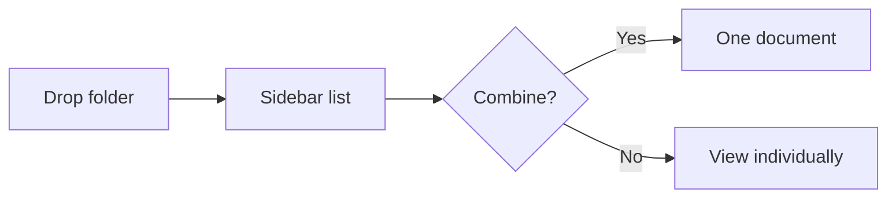

# Appendix

The third file. Includes a Mermaid diagram to confirm diagrams render inside a
combined document.

## Diagram

## Notes

Duplicate "Notes" heading (also in usage) — combined TOC should give these
distinct anchors.
