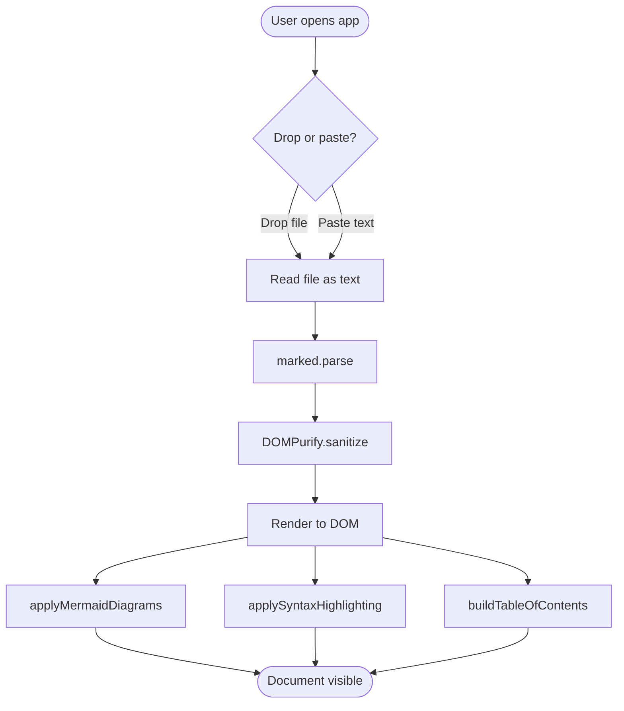
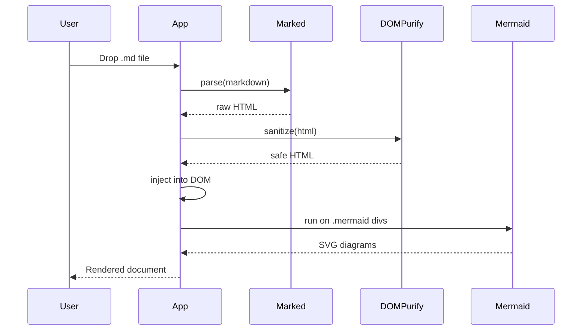

# Mermaid Diagram Test

This document contains three Mermaid diagrams: a flowchart, a sequence diagram, and one intentionally broken diagram to verify error handling.

## Flowchart



## Sequence diagram



## Intentionally broken diagram

This block has invalid Mermaid syntax. The app should NOT crash — it should leave a visible error in place of the diagram and continue rendering the rest of the document.

```mermaid
flowchart TD
    A --> this is not valid mermaid syntax (((
    B --> { unclosed brace
```

## After the broken diagram

If you can read this paragraph, that confirms the error in the previous diagram didn't break the rest of the page.

## Theme test

After all three diagrams render, click the 🌙/☀️ theme toggle in the header. The diagrams should re-render with colors that match the new theme (dark-mode diagrams have dark backgrounds with light text; light-mode diagrams have light backgrounds with dark text). The intentionally-broken diagram should still display its error.
